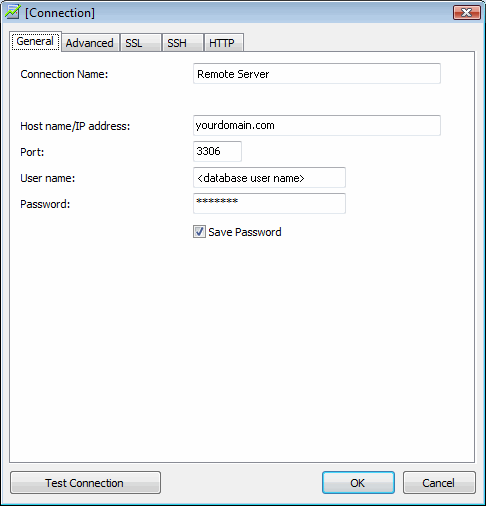
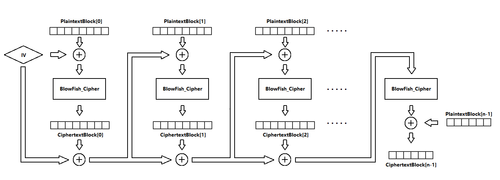

# How Does Navicat Encrypt Password?

## 1. What is Navicat?

* Navicat is a series of graphical database management and development software produced by PremiumSoft CyberTech Ltd. for MySQL, MariaDB, Oracle, SQLite, PostgreSQL and Microsoft SQL Server.

* It has an Explorer-like graphical user interface and supports multiple database connections for local and remote databases. Its design is made to meet the needs of a variety of audiences, from database administrators and programmers to various businesses/companies that serve clients and share information with partners.

## 2. What does indicate that Navicat encrypts password?
* If you use Navicat to manage one of your databases, the first thing you should do is to create a connection to the database. So that means you should fill textboxes on the window showed below with the database's information like `host name`, `User name`, `Password` and so on.

    

* If you check "Save Password", after you click "Ok" button, Navicat will encrypt the password and then save the connection configuration, containing encrypted password, in **Windows Registry**. The exact path is showed below:

    |Database Type|Path                                                                                       |
    |-------------|-------------------------------------------------------------------------------------------|
    |MySQL        |HKEY_CURRENT_USER\\Software\\PremiumSoft\\Navicat\\Servers\\`<your connection name>`       |
    |MariaDB      |HKEY_CURRENT_USER\\Software\\PremiumSoft\\NavicatMARIADB\\Servers\\`<your connection name>`|
    |Microsoft SQL|HKEY_CURRENT_USER\\Software\\PremiumSoft\\NavicatMSSQL\\Servers\\`<your connection name>`  |
    |Oracle       |HKEY_CURRENT_USER\\Software\\PremiumSoft\\NavicatOra\\Servers\\`<your connection name>`    |
    |PostgreSQL   |HKEY_CURRENT_USER\\Software\\PremiumSoft\\NavicatPG\\Servers\\`<your connection name>`     |
    |SQLite       |HKEY_CURRENT_USER\\Software\\PremiumSoft\\NavicatSQLite\\Servers\\`<your connection name>` |

* Here blow is an example:

    

## 3. How does Navicat encrypt password?
Navicat use blowfish algorithm to encrypt password string. Here below is what Navicat did:

### 1. Generate Key.  
* Navicat use SHA-1 algorithm to generate a 160-bits' key.
* The SHA-1 digest of an ASCII string---**"3DC5CA39"**, 8 bytes long---is the key used in blowfish cipher.
* The exact value is:
    ~~~cpp
    unsigned char Key[20] = { 0x42, 0xCE, 0xB2, 0x71, 0xA5, 0xE4, 0x58, 0xB7, 0x4A, 0xEA, 0x93, 0x94, 0x79, 0x22, 0x35, 0x43, 0x91, 0x87, 0x33, 0x40 };
    ~~~
### 2. Initialize Initial Vector(IV)
* We know that blowfish algorithm could only encrypt an **8-bytes-long** block every time.
* At the beginning, Navicat fills an **8-bytes-long** block with **0xFF**, then uses blowfish algorithm encrypt the block by the key mentioned above. After that the 8-bytes-long block is Initial Vector(IV).
* The exact value of IV is:
    ~~~cpp
    unsigned char IV[8] = { 0xD9, 0xC7, 0xC3, 0xC8, 0x87, 0x0D, 0x64, 0xBD };
    ~~~

### 3. Encrypt Password String.
* NOTICE: Here, the password string is an ASCII string, and we **DO NOT** consider the "NULL" terminator.
* Navicat use a pipeline to encrypt password string. The pipeline is showed below:

    

* NOTICE: Every plaintext block is an 8-bytes-long block. Only when the last plaintext block is not 8-bytes-long, will the last step showed in the picture above be executed. Otherwise, the last step is just like the middle two steps.

### 4. Store The Encrypted Password.
* The encrypted password stored in Windows Registry is the join of hex strings of every cipher blocks.

## 2. How to use the sample code.
* Please make sure that you have `Python3`.
* Please make sure that you have `blowfish` module if you just want to use `NavicatEncrypt.py`. You can install `blowfish` module by inputing command:
    > pip install blowfish

    to your Command Prompt.

* Please make sure that you have 'pypiwin32' module if you want to use `NavicatEncrypt.py` and `ShowNavicat.py`. You can install 'pypiwin32' by inputing command:
    > pip install pypiwin32

    to your Command Prompt.

* The following is a sample:
    ~~~cmd
    E:\GitHub\how-does-navicat-encrypt-password\python3>python
    Python 3.6.1 (v3.6.1:69c0db5, Mar 21 2017, 18:41:36) [MSC v.1900 64 bit (AMD64)] on win32
    Type "help", "copyright", "credits" or "license" for more information.
    >>> import NavicatEncrypt

    >>> NavicatEncrypt.Encrypt_Navicat(bytearray(b'This is a test')).hex().upper()
    '0EA71F51DD37BFB60CCBA219BE3A'

    >>> NavicatEncrypt.Decrypt_Navicat(bytearray.fromhex('0EA71F51DD37BFB60CCBA219BE3A')).decode('ascii')
    'This is a test'
    ~~~

* You can just run `ShowNavicat.py` to get all of your database passwords that were stored by Navicat in Windows Registry.
