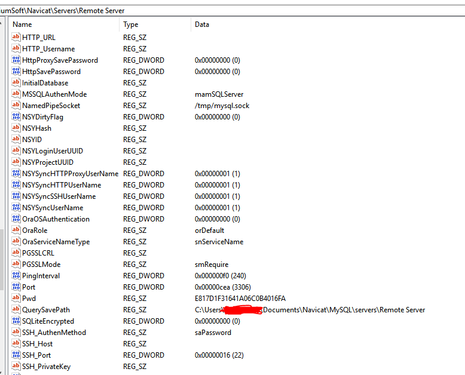

# How Does Navicat Encrypt Password?

This repo will tell you how Navicat encrypts password and offer a tool to reveal passwords encrypted by Navicat.

## 1. What is Navicat?

Navicat is a series of graphical database management and development software produced by PremiumSoft CyberTech Ltd. for MySQL, MariaDB, Oracle, SQLite, PostgreSQL and Microsoft SQL Server.

It has an Explorer-like graphical user interface and supports multiple database connections for local and remote databases. Its design is made to meet the needs of a variety of audiences, from database administrators and programmers to various businesses/companies that serve clients and share information with partners.

## 2. What does indicate that Navicat encrypts password?

If you use Navicat to manage one of your databases, the first thing you should do is to create a connection to the database. So that means you should fill textboxes on the window showed below with the database's information like `Host name`, `User name`, `Password` and so on.

<div align="center">
  
</div>

If you check "Save Password", after you click "Ok" button, Navicat will encrypt the password and then save the connection configuration, containing encrypted password, in **Windows Registry**. The exact path is showed below:

|Database Type|Path                                                                                       |
|-------------|-------------------------------------------------------------------------------------------|
|MySQL        |HKEY_CURRENT_USER\\Software\\PremiumSoft\\Navicat\\Servers\\`<your connection name>`       |
|MariaDB      |HKEY_CURRENT_USER\\Software\\PremiumSoft\\NavicatMARIADB\\Servers\\`<your connection name>`|
|MongoDB      |HKEY_CURRENT_USER\\Software\\PremiumSoft\\NavicatMONGODB\\Servers\\`<your connection name>`|
|Microsoft SQL|HKEY_CURRENT_USER\\Software\\PremiumSoft\\NavicatMSSQL\\Servers\\`<your connection name>`  |
|Oracle       |HKEY_CURRENT_USER\\Software\\PremiumSoft\\NavicatOra\\Servers\\`<your connection name>`    |
|PostgreSQL   |HKEY_CURRENT_USER\\Software\\PremiumSoft\\NavicatPG\\Servers\\`<your connection name>`     |
|SQLite       |HKEY_CURRENT_USER\\Software\\PremiumSoft\\NavicatSQLite\\Servers\\`<your connection name>` |

The following is an example:

<div align="center">
  
</div>

## 3. How does Navicat encrypt password?

See [here](doc/how-does-navicat-encrypt-password.md).

## 4. How to use the sample code in python3 folder?

* Please make sure that you have `Python3`.

* Please make sure that you have `pycryptodome` module if you want to use `NavicatCipher.py` and `NcxReader.py`.

  You can install `pycryptodome` module by command:

  ```console
  $ pip install pycryptodome
  ```

* Please make sure that you have `pypiwin32` module if you want to use `ShowNavicat.py`.

  You can install `pypiwin32` module by command:

  ```console
  $ pip install pypiwin32
  ```

1. __NavicatCipher.py__

   ```
   Usage:
       NavicatCrypto.py <enc|dec> [-ncx] <plaintext|ciphertext>

       <enc|dec>                "enc" for encryption, "dec" for decryption.
                                This parameter must be specified.

       [-ncx]                   Indicate that plaintext/ciphertext is
                                prepared for/exported from NCX file.
                                This parameter is optional.

       <plaintext|ciphertext>   Plaintext string or ciphertext string.
                                NOTICE: Ciphertext string must be a hex string.
                                This parameter must be specified.
   ```

   __Example:__

   ```console
   $ ./NavicatCipher.py enc "This is a test"
   0EA71F51DD37BFB60CCBA219BE3A

   $ ./NavicatCipher.py dec 0EA71F51DD37BFB60CCBA219BE3A
   This is a test

   $ ./NavicatCipher.py enc -ncx "This is a test"
   B75D320B6211468D63EB3B67C9E85933

   $ ./NavicatCipher.py dec -ncx B75D320B6211468D63EB3B67C9E85933
   This is a test

   $ python3
   Python 3.6.7 (default, Oct 22 2018, 11:32:17)
   [GCC 8.2.0] on linux
   Type "help", "copyright", "credits" or "license" for more information.
   >>> from NavicatCipher import *
   >>> cipher = Navicat12Crypto()
   >>> cipher.EncryptString('This is a test')
   '0EA71F51DD37BFB60CCBA219BE3A'

   >>> cipher.DecryptString('0EA71F51DD37BFB60CCBA219BE3A')
   'This is a test'

   >>> cipher.EncryptStringForNCX('This is a test')
   'B75D320B6211468D63EB3B67C9E85933'

   >>> cipher.DecryptStringForNCX('B75D320B6211468D63EB3B67C9E85933')
   'This is a test'
   ```

2. __NcxReader.py__

   Show database servers' information inside `*.ncx` file.

   ```
   Usage:
       NcxReader.py <Path to ncx file>
   ```

   __Example:__

   ```console
   $ ./NcxReader ~/connectioms.ncx
   -----------------xxxxxxxxxxxx--------------------
   Connection Type  = MYSQL
   Host             = localhost
   Port             = 3306
   UserName         = root
   Password         = 12345678

   ------------------yyyyyyyyyy---------------------
   Connection Type  = MYSQL
   Host             = example.com
   Port             = 3306
   UserName         = server
   Password         = 0000000000

   ...
   ...
   ...
   ```

3. __ShowNavicat.py__

   Just run it in Windows. It will list all Navicat configurations inside Windows Registry.

   __Example:__

   ```console
   >ShowNavicat.py
   +--------------------------------------------------+
   |                   MySQL Server                   |
   +--------------------------------------------------+

   Host:              example.com
   Port:              3306
   Username:          server
   Password:          0000000000

   ...
   ...

   +--------------------------------------------------+
   |                  MariaDB Server                  |
   +--------------------------------------------------+

   ...
   ...

   +--------------------------------------------------+
   |                  MongoDB Server                  |
   +--------------------------------------------------+

   ...
   ...

   ...
   ...
   ```

